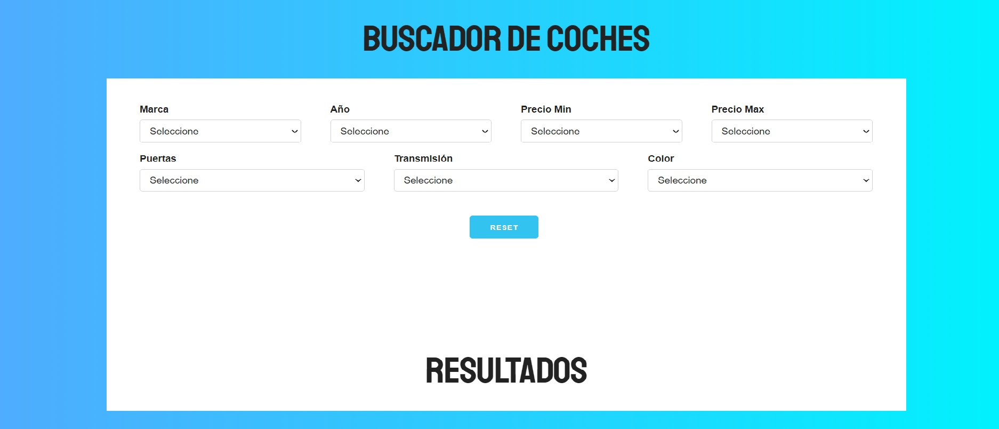

# Filtrar-campos-JS
Filtrar por distintos campos individuales

##Objetivo
+ Creacion de Eventos.
+ Filtrar por campos individualmente. 
+ Generar HTML en el DOM.

### Visita el proyecto.

[Visita el proyecto](https://miguelpl32.github.io/Filtrar-campos-JS/)

## Lenguajes
+ Javascript
